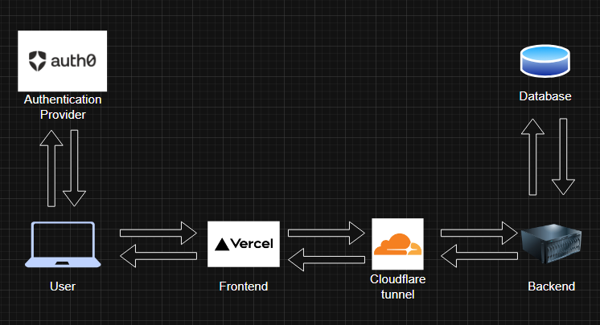

# KamerLink

## Project Idea
A service that lets students vote on, create initiatives for their school, socialize and share news with each other.

## High level idea implementation

The service will consist of multiple parts

### Frontend
Will be written in TypeScript+React and is going to be hosted on vercel (may change later on to self hosting)

### Backend
Will be written in Rust using Axum as backbone. Will be hosted at home/at the school grounds

### Database
Backend will communicate with the MongoDB database. it will store users, post information and other information critical for the service.

The database is hosted on the same machine as the backend

### Image storage
Will be decided upon successful implementation of the post API
(probably will be stored on the backend server's machine)

### User authentication
Users will be able to login using their school email only. Auth0 will be used as the backbone for user authentication.

## Documentation of the code structure

The codebase is separated into two parts:
- Backend
- Frontend

Documentation for each of the parts is stored in ./docs/codebase_docs/FRONTEND.md and ./docs/codebase_docs/BACKEND.md respectively 

## Basic Kamerlink architecture diagram

## TODO

- See issues
